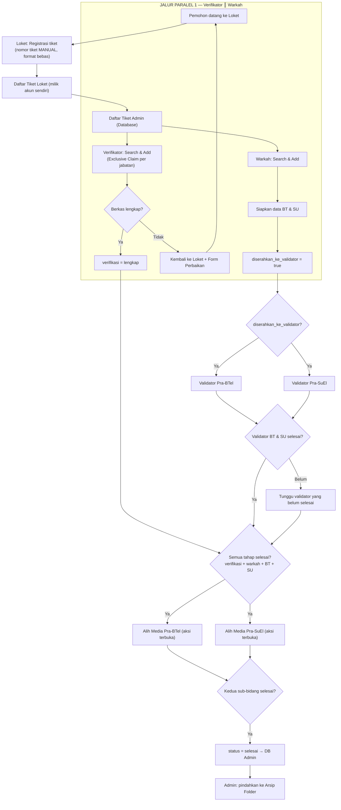

# 00 — Alur Lengkap Sistem LOKET 2026 (Revisi Final)

> **Sistem Loket Pertanahan Elektronik BMN BALAM**
> Evaluasi Alur Final — **9 Role / 8 Stage** — sesuai `ALUR DIAGRAM VERSI RIZKI - REVISI (FINAL).docx` (12 September 2026).
> **Konfigurasi Alur Paralel (13 Sep 2026):** Verifikator ║ Warkah bekerja paralel; Validator BT/SU mulai setelah Warkah menandai `diserahkan_ke_validator`; Alih Media hanya untuk tiket yang **semua** tahap selesai; nomor tiket **manual** (format bebas).

---

## 1. Ringkasan Sistem

LOKET 2026 mengelola alur berkas permohonan pertanahan dari pendaftaran di **Loket** hingga **Selesai/Arsip**. Setiap tiket berjalan melalui **8 stage utama** dengan **jalur paralel** antar tahapan yang tidak saling menunggu:

```
LOKET ──▶ DB ADMIN ──▶ (VERIFIKATOR ║ WARKAH) ──▶ (VALIDATOR BT ║ VALIDATOR SU) ──▶ (ALIH MEDIA BT ║ ALIH MEDIA SU) ──▶ SELESAI ──▶ ARSIP
```

Perbedaan kunci dari alur seri sebelumnya:
- **Nomor tiket diisi MANUAL oleh akun Loket — format bebas** (tidak auto-generate).
- **Verifikator ║ Warkah bekerja PARALEL** sejak tiket masuk DB Admin; keduanya tidak saling menunggu.
- **Validator BT & SU mulai setelah Warkah menandai `diserahkan_ke_validator = true`** — tanpa menunggu Verifikator.
- **Alih Media BT & SU hanya terbuka untuk tiket yang SEMUA tahap sebelumnya selesai** (gate AND penuh).
- **Setiap jabatan boleh memiliki banyak akun**; tiap akun hanya melihat & mengerjakan tiket di daftar pribadinya (**Exclusive Ticket Claiming** per jabatan).
- **Pemisahan BT/SU hanya di tahap Validator (Stage 4) dan Alih Media (Stage 5).**
- Semua akun stage bekerja dengan pola **Search → Add → Process → Selesai → Back to Admin** terhadap **Daftar Tiket Admin (Database)**.

---

## 2. Struktur 8 Stage & Konsep Desain

### 2.1 Struktur 8 Stage

| Stage | Jabatan (Role) | Pemisahan BT/SU |
|---|---|---|
| 1 | Loket | Semua jenis permohonan |
| 2 | Verifikator | Semua jenis permohonan — **paralel** dgn Warkah |
| 3 | Warkah | Semua jenis permohonan; menyiapkan BT & SU — **paralel** dgn Verifikator |
| 4A | Validator Pra-BTel | KHUSUS Buku Tanah (BT) |
| 4B | Validator Pra-SuEl | KHUSUS Surat Ukur (SU) |
| 5A | Alih Media Pra-BTel | KHUSUS Buku Tanah (BT) |
| 5B | Alih Media Pra-SuEl | KHUSUS Surat Ukur (SU) |
| Selesai | Semua jabatan + Admin | Tiket selesai semua tahap |

### 2.2 Konsep Desain: RBAC + Multi-Stage Workflow

Sistem memadukan manajemen hak akses berbasis **jabatan (Role-Based Access Control)** dengan alur kerja bertahap berstatus (**Multi-Stage Workflow / FSM**):

| Konsep | Penjelasan |
|---|---|
| **RBAC (Role-Based Access Control)** | Setiap jabatan memiliki `role` sendiri; middleware `role` membuka hanya menu & halaman milik jabatan tersebut. |
| **Multi-Stage Workflow (FSM)** | Status tiket berpindah antar tahap dengan aturan transisi eksplisit: `diterima` → `verifikasi` / `warkah` → `validasi_btel` / `validasi_suel` → `alih_media_btel` / `alih_media_suel` → `selesai`. |
| **Parallel Gateway** | Verifikator ║ Warkah berjalan paralel; setelah Warkah menandai `diserahkan_ke_validator`, Validator BT ║ Validator SU juga paralel. |
| **Conditional Gateway** | Validator BT/SU baru bisa meng-Add tiket saat `diserahkan_ke_validator = true`; Alih Media hanya untuk tiket yang **semua** tahap sebelumnya `selesai`. |
| **Exclusive Ticket Claiming** | Action "Add" bersifat eksklusif per jabatan: tiket yang sudah di-Add satu akun tidak bisa di-Add akun lain di **jabatan yang sama** (anti duplikat). |
| **Jabatan realtime** | Admin dapat mengubah jabatan akun kapan saja; perubahan berlaku **real-time** pada hak akses sistem. |

> **Makna "Tunggal":** kata "tunggal" pada dokumen generasi lama berarti *satu jabatan menangani satu lingkup* (mis. Verifikator memeriksa semua jenis berkas), **bukan** berarti hanya boleh ada satu akun. **Setiap jabatan boleh memiliki banyak akun.**

### 2.3 Jabatan → Role → Tahapan & Rule

| # | Jabatan | Role (kode) | Tahapan | Aturan & Ruang Lingkup |
|---|---|---|---|---|
| 1 | Admin | `admin` | Semua | Kelola Database, tiket, revisi, arsip, dan akun |
| 2 | Pemimpin | `pemimpin` | Monitoring | View-only, aksi terkunci |
| 3 | Loket | `loket` | Stage 1 | Registrasi tiket; **nomor tiket manual (format bebas)** |
| 4 | Verifikator | `verifikator` | Stage 2 | **Paralel** dgn Warkah; Exclusive Claim per jabatan |
| 5 | Warkah | `warkah` | Stage 3 | **Paralel** dgn Verifikator; menandai `diserahkan_ke_validator` |
| 6 | Validator BT | `validator_btel` | Stage 4A | Mulai saat `diserahkan_ke_validator`; tanpa menunggu Verifikator |
| 7 | Validator SU | `validator_suel` | Stage 4B | Mulai saat `diserahkan_ke_validator`; tanpa menunggu Verifikator |
| 8 | Alih Media BT | `alih_media_btel` | Stage 5A | Hanya jika **SEMUA** tahap sebelumnya selesai |
| 9 | Alih Media SU | `alih_media_suel` | Stage 5B | Hanya jika **SEMUA** tahap sebelumnya selesai |

---

## 3. Alur Utama Tiket (Garis Besar)

```
1. LOKET meregistrasi tiket — nomor tiket diisi MANUAL (format bebas)
   → tersimpan di Daftar Tiket Loket (milik akun sendiri)
   sekaligus masuk ke Daftar Tiket Admin (database seluruh tiket).

2. KEDUA JALUR PARALEL dimulai dari DB Admin:
   • VERIFIKATOR mencari tiket (nomor tiket / nomor sertipikat, harus LENGKAP)
     → pemeriksaan berkas fisik vs data input.
     LENGKAP → status verifikasi 'lengkap' (salah satu syarat lanjut).
     TIDAK lengkap → kembali ke Loket untuk revisi.
   • WARKAH menyiapkan data pendukung BT & SU.
     Selesai → status sertipikat DISERAHKAN + `diserahkan_ke_validator = true`.

3. VALIDATOR Pra-BTel & Validator Pra-SuEl baru bisa meng-Add tiket yang sudah
   ditandai `diserahkan_ke_validator` (TIDAK menunggu Verifikator).
   Kedua bidang harus selesai sebelum lanjut.

4. ALIH MEDIA Pra-BTel & Pra-SuEl hanya terbuka untuk tiket yang SEMUA tahap
   sebelumnya selesai (verifikasi 'lengkap', warkah selesai + diserahkan,
   validasi BT & SU selesai) → menyelesaikan proses alih media.

5. Kedua Alih Media selesai → Tiket SELESAI → kembali ke Daftar Tiket Admin,
   dapat diarsipkan oleh Admin.
```

---

## 4. Diagram Alur (Mermaid)



---

## 5. Status Tiket, Badge, dan Transisi (FSM)

| Status Tiket | Badge | Keterangan |
|---|---|---|
| diterima | warning (kuning) | Baru masuk di loket |
| verifikasi | info (biru muda) | Sedang diperiksa verifikator (paralel dgn warkah) |
| warkah | secondary (abu) | Di bagian warkah (paralel dgn verifikasi) |
| validasi_btel | primary (biru) | Sedang divalidasi BT |
| validasi_suel | purple (ungu) | Sedang divalidasi SU |
| alih_media_btel | dark (hitam) | Sedang proses alih media BT |
| alih_media_suel | indigo (nila) | Sedang proses alih media SU |
| selesai | success (hijau) | Semua tahap selesai |
| dikembalikan | danger (merah) | Dikembalikan untuk perbaikan |
| batal | danger (merah) | Dibatalkan |

### Status Sertipikat Warkah & `diserahkan_ke_validator`

| Status / Tanda | Badge | Keterangan |
|---|---|---|
| `PROSES` | warning (kuning) | Sertipikat sedang disiapkan Warkah |
| `DISERAHKAN` | success (hijau) | Sertipikat sudah diserahkan Warkah |
| `diserahkan_ke_validator = true` | teal (tosca) | **Gerbang pembuka Validator BT/SU** — ditandai Warkah; Validator dapat mulai tanpa menunggu Verifikator |

Status progres per tahap (3 level): `menunggu` / `proses` / `selesai` (abu / biru / hijau).

> **FSM ringkas:** `diterima` → (`verifikasi` ║ `warkah`) → `diserahkan_ke_validator` → (`validasi_btel` ║ `validasi_suel`) → (`alih_media_btel` ║ `alih_media_suel`) → `selesai` → Arsip. Setiap cabang paralel wajib `selesai` sebelum tiket masuk Alih Media.

### 5.3 Matriks Transisi Lengkap (FSM Detail)

Diturunkan dari perilaku nyata `TiketFlowService` dan diverifikasi end‑to‑end oleh `tests/Feature/DemoAlurRealtimeTest.php`.

| Dari | Ke | Pemicu (HTTP route) | Rule / Guard |
|---|---|---|---|
| `diterima` | `verifikasi` | Verifikator **Add** (`POST /verifikator/add/{id}`) | Tiket dari Loket; belum pernah diverifikasi |
| `diterima` | `warkah` | Warkah **Add** (`POST /warkah/add/{id}`) | Paralel dgn Verifikator — tidak saling menunggu |
| `verifikasi` | `dikembalikan` | Verifikator **Revisi** (`POST /verifikator/{id}/revisi`, `isi_revisi ≥ 3`, `ke_stage=loket`) | `revisi_ke + 1`; catatan revisi `sudah_diproses=false`; tiket kembali ke Loket |
| `dikembalikan` | `verifikasi` | Loket **Resubmit** (`POST /loket/{id}/resubmit`) | Perbaikan diterima; `status_pembetulan` **naik** (P0→P1…); revisi ditandai `sudah_diproses=true` |
| `verifikasi` | `diterima` | Verifikator **Selesai** (`POST /verifikator/{id}/selesai`) | Kembali ke DB Admin |
| `warkah` | `dikembalikan` | Warkah/Validator **Revisi internal** (`ke_stage=warkah`) | Revisi internal: `revisi_ke + 1` tetapi P‑code **tidak berubah** |
| `warkah` | `diterima` | Warkah **Selesai** | Kembali ke DB Admin |
| `diterima` | `validasi_btel` | Validator BT **Add** | Wajib `diserahkan_ke_validator=true` (dari Warkah) — **tanpa menunggu Verifikator** |
| `diterima` | `validasi_suel` | Validator SU **Add** | Sama |
| `validasi_btel` | `diterima` | Validator BT **Selesai** | `status_pra_btel=selesai`; kembali ke DB Admin |
| `validasi_suel` | `diterima` | Validator SU **Selesai** | `status_pra_suel=selesai`; kembali ke DB Admin |
| `diterima` | `alih_media_btel` | Alih Media BT **Add** | **Gate AND penuh**: `verifikasi` ║ `warkah` ║ `validasi_btel` ║ `validasi_suel` semuanya `selesai` |
| `diterima` | `alih_media_suel` | Alih Media SU **Add** | Sama |
| `alih_media_btel` | `selesai` | Alih Media BT **Selesai** (setelah SU juga selesai) | Yang terakhir selesai memicu `status=selesai` + `tanggal_selesai` |
| `alih_media_suel` | `selesai` | Alih Media SU **Selesai** (setelah BT juga selesai) | Sama |
| *sembarang aktif* | `batal` | Admin/ditolak | Tiket tidak muncul di tahap selanjutnya |

> Status tiket meniru **tahap aktif terakhir** (`activeStageStatus`): penyelesaian satu cabang paralel tidak menimpa status cabang yang masih diproses.

---

## 6. Pola Universal "Search → Add → Process → Done → Back to Admin"

Berlaku untuk semua jabatan stage (Verifikator, Warkah, Validator Pra-BTel, Validator Pra-SuEl, Alih Media Pra-BTel, Alih Media Pra-SuEl):

| Langkah | Deskripsi |
|---|---|
| 1. **Search** | Cari tiket di Database Admin berdasarkan **Nomor Tiket** (manual) / **Nomor Sertipikat** — harus ketik **LENGKAP** agar hasil muncul. |
| 2. **Add** | Klik "Add" → tiket masuk Daftar Tiket akun tersebut. **Exclusive Ticket Claiming**: tiket yang sudah di-Add satu akun tidak bisa di-Add akun lain di **jabatan yang sama** (anti duplikat). |
| 3. **Process** | Proses kerja sesuai bidang (isi status, catatan, checklist). |
| 4. **Done** | Klik "Selesai" → kembali ke DB Admin, hilang dari menu sendiri, masuk menu "Selesai". |
| 5. **Print** | Print (termasuk **Cetak Form Perbaikan**) tersedia di detail tiket, akun penanggung jawab. |

> **Add ≠ serah terima antar jabatan.** Karena alur paralel, jadwal akses tiap jabatan diatur **gate** (lihat §4): Verifikator & Warkah bebas sejak tiket di DB Admin; Validator menunggu `diserahkan_ke_validator`; Alih Media menunggu **semua** tahap selesai.

---

## 7. Flow Revisi

Dua jenis loop revisi didukung dan sudah diverifikasi end‑to‑end:

### 7.1 Revisi Eksternal (Petugas → Loket → Resubmit)

Dari tahap mana pun yang menolak berkas karena kebutuhan **perbaikan pemohon**:

```text
Verifikator/Validator menulis catatan revisi (isi_revisi ≥ 3)
        │  POST /{tahap}/{id}/revisi  (ke_stage = loket)
        ▼
status tiket = dikembalikan, revisi_ke+1
        │
        ▼
Loket melihat alert merah "Berkas Dikembalikan untuk Perbaikan Revisi" + isi catatan
Admin melihat tiket di menu Revisi Perbaikan
        │
        ▼
Pemohon menyerahkan perbaikan → Loket klik "Terima Perbaikan"
        │  POST /loket/{id}/resubmit
        ▼
revisi ditandai sudah_diproses=true; status_pembetulan NAik (P0→P1→P2…)
status tiket = tahap asal; petugas meng-Add ulang dan melanjutkan.
```

### 7.2 Revisi Internal (antar-tahap pelaksana)

Perbaikan yang **tidak melibatkan pemohon** (mis. Validator BT ingin data warkah dikoreksi):

```text
Validator BT menulis catatan revisi (ke_stage = warkah)
        │  POST /validator-bt/{id}/revisi
        ▼
status = dikembalikan, revisi_ke+1  (P‑code TIDAK berubah)
        ▼
Warkah melihat menu "Revisi Menunggu Saya" → Add ulang (dibuka oleh revisi pending)
        ▼
Warkah memperbaiki → Selesai → Validator BT Add ulang → lulus → lanjut
```

> **Perbedaan kunci:** revisi eksternal (via Loket) menaikkan `status_pembetulan` P1..Pn (kode combine publik); revisi internal **hanya** menaikkan `revisi_ke`. Kode pembetulan `P1, P2, P3, …` TIDAK terbatas (kolom `status_pembetulan` bertipe string).

---

## 8. Aturan & Ketentuan Alur (Krusial)

1. **Basis Data Terpusat** — semua tiket dari semua akun Loket masuk Daftar Tiket Admin.
2. **Nomor Tiket Manual** — diisi akun Loket, **format bebas** (bukan auto-generate); menjadi kunci pencarian.
3. **Saling Terhubung** — tiap tahapan terhubung ke DB Admin via mesin pencarian nomor tiket.
4. **Banyak Akun per Jabatan** — setiap jabatan boleh memiliki banyak akun; tiap akun hanya melihat tiket di daftar pribadinya.
5. **Exclusive Claim per Jabatan** — tiket yang sudah di-Add satu akun tidak muncul lagi di akun lain pada **jabatan yang sama** (anti duplikat).
6. **Paralel Verifikator ║ Warkah** — kedua jabatan dapat meng-Add tiket yang sama dari DB Admin tanpa saling menunggu.
7. **Gerbang Validator** — Validator BT/SU hanya bisa meng-Add tiket yang sudah `diserahkan_ke_validator = true` dari Warkah; **tidak menunggu Verifikator**.
8. **Gate Alih Media (AND penuh)** — Alih Media BT/SU hanya terbuka untuk tiket yang SEMUA tahap selesai (verifikasi lengkap, warkah selesai + diserahkan, validasi BT & SU selesai).
9. **Nama Penanggung Jawab** otomatis & terkunci.
10. **Status Batal** tidak ditampilkan di pencarian tahapan selanjutnya.
11. **Tiket Selesai** → masuk DB Admin; Admin dapat memindahkannya ke Arsip.
12. **Export (PDF/Excel)** tersedia di semua akun (Daftar, Dashboard, Revisi, Selesai).
13. **Detail Tiket** — nama penanggung jawab tiap tahap hanya tampil di akun penanggung jawabnya.
14. **Kode Revisi** P1..Pn tak terbatas.

---

## 8.5 Kondisi & Berkas Edge (Diverifikasi Demo Realtime)

Perilaku saat aturan dilanggar — pesan error persis di-assert di `DemoAlurRealtimeTest`:

| Kondisi | Yang Terjadi | Pesan Error di UI |
|---|---|---|
| Validator BT/SU meng-Add sebelum Warkah menandai `diserahkan_ke_validator` | Add ditolak | `Tiket {kode} belum diserahkan oleh Warkah ke Validator (diserahkan_ke_validator belum aktif); belum dapat diproses di tahap validasi_btel.` |
| Alih Media meng-Add saat salah satu tahap prasyarat belum selesai | Add ditolak | `Tiket {kode} belum selesai pada tahap verifikasi; belum dapat diproses di tahap alih_media_btel.` (menyebut tahap prasyarat pertama yang belum selesai) |
| Akun kedua pada jabatan yang sama meng-Add tiket yang sudah di-Add akun pertama | Add ditolak (Exclusive Claim) | `Tiket {kode} sedang diproses akun lain pada tahap ini.` |
| Tiket sudah `selesai`/`batal` di-Add ulang | Add ditolak | `Tiket sudah selesai/dibatalkan dan tidak dapat diambil.` |
| Tahap yang sudah pernah selesai di-Add ulang (tanpa revisi pending) | Add ditolak | `Tiket {kode} sudah selesai pada tahap verifikasi dan tidak dapat di-Add ulang.` |
| Form revisi tanpa `isi_revisi` (kurang dari 3 karakter) | Validasi | `isi_revisi` wajib diisi (min 3) |
| Kolom opsional Loket tidak dikirim pada registrasi | Tetap sukses (diperbaiki) | `LoketController@store` kini memakai `?? null` |

> Semua pesan di atas berasal dari **controller/route asli**, bukan simulasi test.

---

## 8.6 Visibilitas Catatan & Informasi per Role

| Informasi | Loket | Verifikator | Warkah | Validator BT/SU | Alih Media | Admin | Pemimpin | Publik (Tracking) |
|---|---|---|---|---|---|---|---|---|
| Antrian tiket milik akun sendiri | ✅ | — | — | — | — | semua tiket | semua tiket | — |
| Catatan lembar kerja tahap sendiri | ❌ | ❌ | ✅ (lembar Warkah) | ✅ (lembar validasi sendiri) | ✅ (lembar tahap sendiri) | ✅ (lembar kerja detail) | view | ❌ |
| Catatan kerja tahap lain | ❌ | ❌ | ❌ | ❌ | ❌ | ✅ | view | ❌ |
| **Timeline `riwayat_statuses` (global)** | ✅ | ✅ | ✅ | ✅ | ✅ | ✅ | ✅ | ✅ (Riwayat Perjalanan Berkas) |
| Catatan final penugasan (`tiket_penugasan.catatan`) | ❌ | ❌ | ❌ | ❌ | ❌ | ✅ (Detail Admin) | view | ❌ |
| Isi catatan revisi (`catatan_revisi.isi_revisi`) | ✅ (alert merah) | ✅ (akun pengirim) | ✅ (Revisi Menunggu Saya) | ✅ (akun pengirim) | ✅ | ✅ (menu Revisi) | view | ❌ |
| Kode pembetulan P1..Pn | ✅ | ✅ | ✅ | ✅ | ✅ | ✅ | ✅ | ✅ (badge pembetulan) |
| Nama penanggung jawab tiap tahap | pada penugasan miliknya | pada penugasan miliknya | pada penugasan miliknya | pada penugasan miliknya | pada penugasan miliknya | ✅ semua | view | ❌ |

> **Prinsip:** catatan kerja tahap **privat per akun/tahap**; timeline & status **global**; catatan final penugasan **hanya di Detail Admin**; isi revisi terlihat **pengirim, penerima, dan Admin**.

---

```
📊 DASHBOARD (semua akun) ── 🔍 PORTAL TRACKING PUBLIK (semua akun)

ADMIN:                        PEMIMPIN (view-only, aksi terkunci):
 ├─ Daftar Tiket (Database)    ├─ Dashboard Pemimpin
 ├─ Tambah Tiket               ├─ Monitoring Tiket
 ├─ Tiket Selesai              └─ Print Monitoring
 ├─ Revisi (Perbaikan)
 ├─ Arsip Folder
 └─ Manajemen Akun

LOKET:                        VERIFIKATOR:
 ├─ Pendaftaran Baru           └─ Verifikasi Berkas
 └─ Daftar Tiket Loket

WARKAH:                       VALIDATOR Pra-BTel:
 └─ Lembar Kerja Warkah        └─ Validasi Pra-BTel

VALIDATOR Pra-SuEl:           ALIH MEDIA Pra-BTel:
 └─ Validasi Pra-SuEl          └─ Alih Media BT

ALIH MEDIA Pra-SuEl:
 └─ Alih Media SU

📈 LAPORAN & REKAP SLA (semua akun)
```

Setiap halaman stage menyajikan seksi **Daftar (Antrian Aktif Saya) / Revisi Menunggu / Selesai**.

---

## 10. Endpoint Penting

| URL | Fungsi |
|---|---|
| `/` | Redirect ke Dashboard (sudah login) atau Tracking Publik |
| `/login`, `/logout` | Autentikasi |
| `/tracking`, `/tracking/{kode}` | Tracking publik (tanpa login) |
| `/dashboard` | Dashboard utama |
| `/admin`, `/admin/tambah-tiket`, `/admin/selesai`, `/admin/revisi`, `/admin/revisi/{id}/hapus`, `/admin/arsip`, `/admin/users` | Modul Admin |
| `/loket`, `/loket/create`, `/loket/{id}/resubmit` | Modul Loket |
| `/verifikator`, `/verifikator/search`, `/verifikator/add/{id}`, `/verifikator/{id}/print-perbaikan` | Modul Verifikator |
| `/warkah`, `/warkah/search`, `/warkah/add/{id}`, `/warkah/{id}/print-perbaikan` | Modul Warkah |
| `/validator-bt`, `/validator-su` | Modul Validator BT/SU |
| `/alih-media-bt`, `/alih-media-su` | Modul Alih Media BT/SU |
| `/reports`, `/reports/print`, `/reports/export` | Laporan, print, export Excel |

---

## 11. Catatan Perubahan dari Versi Sebelumnya

| Aspek | Versi seri sebelumnya | Kini (alur paralel) |
|---|---|---|
| Verifikator & Warkah | Serial: Verifikator → Warkah | **Paralel** sejak tiket ada di DB Admin |
| Nomor tiket | Auto-generate | **Manual**, format bebas |
| Validator BT/SU | Baru bekerja setelah Verifikator & Warkah selesai berurutan | Mulai saat Warkah menandai `diserahkan_ke_validator`; **tanpa menunggu Verifikator** |
| Pemisahan BT/SU | Hanya Validator & Alih Media | Hanya Validator & Alih Media |
| Status utama | `validasi`, `alih_media` tunggal | `validasi_btel/suel`, `alih_media_btel/suel` + `diserahkan_ke_validator` |
| Kode pembetulan | Enum P0..P5 | String P0..Pn (tak terbatas) |
| Aksi Alih Media | Terkunci sampai kedua Validator selesai | Terkunci sampai **SEMUA tahap** selesai (gate AND penuh) |
| Jumlah akun per jabatan | Diasumsikan 1 akun | **Banyak akun**, claim eksklusif per jabatan |

---

*Dokumen bagian dari panduan alur LOKET 2026 — diselaraskan dengan `ALUR DIAGRAM VERSI RIZKI - REVISI (FINAL).docx` + konfigurasi alur paralel (Verifikator ║ Warkah, gate Validator via `diserahkan_ke_validator`, gate Alih Media AND penuh).*