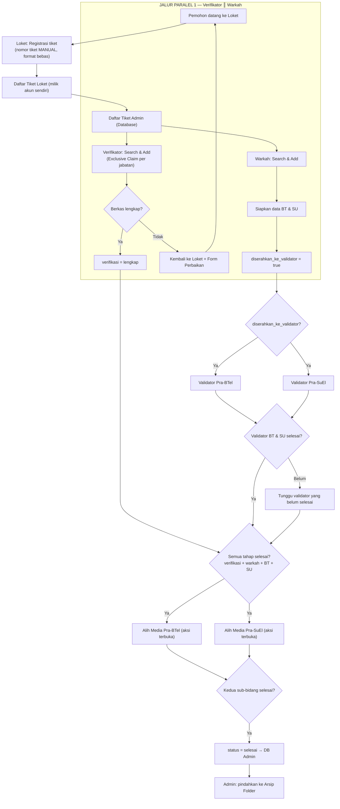

# PRD — Sistem Loket Pelayanan Pertanahan Elektronik
## Kantor Pertanahan Kota Bandar Lampung (BALAM)

**Versi:** 2.2 — FINAL (Alur Paralel)
**Tanggal:** 13 September 2026
**Status:** Evaluasi Alur Final — 9 Role / 8 Stage — Konfigurasi Alur Paralel (Verifikator ║ Warkah; Validator via `diserahkan_ke_validator`; Alih Media gate AND penuh)
**Platform Target:** Laravel 13 + MySQL (via PHPMyAdmin/Laragon)
**Project:** LOKET2026 → `http://localhost:8000`
**Basis Dokumen:** `ALUR DIAGRAM VERSI RIZKI - REVISI (FINAL).docx` · `PETUNJUK TEKNIS.docx` · Excel `Project Loket/02-05`

---

## 1. Pendahuluan & Latar Belakang

Kantor Pertanahan Kota Bandar Lampung mengelola permohonan pelayanan pertanahan menggunakan **6 file Google Sheets/Excel terpisah** (`00 Dashboard Control` s.d. `05 Lembar Kerja Alih Media`) yang dikelola manual oleh masing-masing bagian. Kondisi ini menimbulkan masalah:

| Masalah | Dampak |
|---|---|
| File Excel terpisah per bagian | Tidak ada visibilitas real-time antar bagian |
| Input manual & tidak terstruktur | Rawan human error, data tidak konsisten |
| Tidak ada autentikasi user | File bisa diubah siapa saja |
| Cetak manual (CTRL+P atur sendiri) | Membuang waktu, tampilan tidak seragam |
| Monitoring via Google Sheets | Lambat, tidak real-time, akses terbatas |
| Tidak ada audit trail | Tidak bisa lacak siapa mengubah apa |
| Tidak ada privasi data | Semua akun bisa melihat semua tiket |
| Validator & Alih Media dicampur BT/SU | Membingungkan, rawan kesalahan input |

**Solusi:** Aplikasi **LOKET 2026** — web application berbasis **Laravel + MySQL** yang mereplikasi seluruh alur kerja Excel dengan fitur yang ditingkatkan, sesuai **alur final** pada `ALUR DIAGRAM VERSI RIZKI - REVISI (FINAL).docx`. Sistem terdiri dari **9 role akun (jabatan) dan 8 stage alur**, saling terhubung melalui satu **basis data terpusat di akun Admin (Daftar Tiket Admin / Database)** dengan **alur paralel**: Verifikator ║ Warkah; Validator BT/SU mulai setelah Warkah menandai `diserahkan_ke_validator`; Alih Media hanya untuk tiket yang **semua** tahap selesai.

### Struktur Stage (9 Role / 8 Stage)

| Stage | Akun (Role) | Pemisahan BT / SU |
|---|---|---|
| Stage 1 | Loket | Semua jenis permohonan; **nomor tiket manual (format bebas)** |
| Stage 2 | Verifikator | Semua jenis permohonan — **paralel** dgn Warkah |
| Stage 3 | Warkah | Semua jenis permohonan; siapkan BT & SU — **paralel** dgn Verifikator |
| Stage 4A | Validator Pra-BTel | KHUSUS Buku Tanah (BT) |
| Stage 4B | Validator Pra-SuEl | KHUSUS Surat Ukur (SU) |
| Stage 5A | Alih Media Pra-BTel | KHUSUS Buku Tanah (BT) |
| Stage 5B | Alih Media Pra-SuEl | KHUSUS Surat Ukur (SU) |
| Selesai | Semua akun + Admin | Tiket selesai semua tahap |

> **Pemisahan BT/SU hanya terjadi pada tahap Validator (Stage 4) dan Alih Media (Stage 5).** Verifikator dan Warkah adalah **jabatan bersama** yang menangani kedua bidang, bekerja **paralel**. **Setiap jabatan (bukan hanya Loket) boleh memiliki banyak akun** — kata "tunggal" pada dokumen lama berarti satu lingkup, bukan satu akun.

### Prinsip Utama Sistem

| Kode | Prinsip |
|---|---|
| A | **Basis Data Terpusat** — semua tiket dari semua akun Loket masuk ke Daftar Tiket Admin (Database). |
| B | **Privasi Akun** — setiap akun stage hanya melihat tiket yang sudah di-Add ke daftar tiketnya sendiri. |
| C | **Pola Universal** — Search → Add → Process → Selesai → Back to Admin. |
| D | **Anti Duplikat (Exclusive Claim per jabatan)** — tiket yang sudah di-Add satu akun tidak bisa di-Add akun lain di jabatan yang sama. |
| E | **Print** tersedia di Detail tiket yang sudah selesai, di akun penanggung jawab masing-masing. |
| F | **Jalur Paralel** — Verifikator ║ Warkah dan Validator BT ║ SU berjalan paralel; aksi dibuka mengikuti gate status (`diserahkan_ke_validator`, semua tahap selesai). |
| G | **Nomor Tiket Manual** — diisi akun Loket, **format bebas** (bukan auto-generate). |
| H | **Banyak Akun per Jabatan** — setiap jabatan boleh memiliki banyak akun. |

---

## 2. Tujuan Produk

1. **Digitalisasi** alur permohonan Loket → (Verifikator ║ Warkah) → Validator (BT & SU, mulai via `diserahkan_ke_validator`) → Alih Media (BT & SU, hanya jika semua tahap selesai) → Selesai dalam satu platform web terpusat.
2. **Mempertahankan** semua konsep & terminologi yang sudah dipahami staf (kode tiket, lembar kerja, form perbaikan, dll).
3. **Meningkatkan** efisiensi dengan otomasi: smart search, generate tiket, tracking status otomatis, cetak formulir.
4. **Memberikan** privasi data: setiap akun hanya melihat tiket yang menjadi penanggung jawabnya.
5. **Memberikan** visibilitas real-time kepada pimpinan melalui dashboard monitoring.

---

## 3. Scope

### In Scope ✅
- Sistem manajemen tiket permohonan (registrasi, tracking, status)
- **8 stage alur**: Loket, Verifikator, Warkah, Validator Pra-BTel, Validator Pra-SuEl, Alih Media Pra-BTel, Alih Media Pra-SuEl, Selesai
- Pola universal "Smart Search → Add → Process → Selesai → Back to Admin" untuk setiap akun stage
- Dashboard monitoring per role & pimpinan (view-only)
- Cetak: tanda terima, **form perbaikan**, monitoring, laporan
- Portal Tracking Publik (tanpa login)
- Export Excel (`.xls`)/PDF laporan — tersedia di semua akun
- Multi-role authentication (9 role)
- Privasi: tiket hanya terlihat oleh penanggung jawabnya
- Arsip folder (Admin): Buat Folder → Tambahkan Tiket Selesai

### Out of Scope ❌
- Integrasi langsung dengan sistem KKP/SIMAN BPN Pusat
- Aplikasi mobile
- Pembayaran online / PNBP
- Video call / chat internal

## 4. User Roles & Permissions

### Daftar 9 Jabatan (Role)

| # | Role | Jumlah Akun | Deskripsi |
|---|---|---|---|
| 1 | `admin` | ≥1 (bootstrap permanen) | Administrator sistem — akses penuh semua modul |
| 2 | `pemimpin` | Banyak | Kepala Kantor / Kasi — view-only monitoring (aksi terkunci) |
| 3 | `loket` | Banyak | Petugas penerima berkas — registrasi tiket |
| 4 | `verifikator` | Banyak | Pemeriksa kelengkapan berkas pemohon |
| 5 | `warkah` | Banyak | Petugas warkah — menyiapkan data pendukung BT & SU |
| 6 | `validator_btel` | Banyak | Validator bidang Buku Tanah (BT) |
| 7 | `validator_suel` | Banyak | Validator bidang Surat Ukur (SU) |
| 8 | `alih_media_btel` | Banyak | Petugas alih media bidang BT |
| 9 | `alih_media_suel` | Banyak | Petugas alih media bidang SU |

> **Banyak akun per jabatan:** semua jabatan (bukan hanya Loket) boleh memiliki lebih dari satu akun. Label pada form Manajemen Akun adalah **"Jabatan"**. **Admin dapat mengubah jabatan akun kapan saja; perubahan berlaku real-time.**

### Menu Sidebar per Role

```
ADMIN:                          PEMIMPIN (VIEW ONLY):
├── Dashboard (Monitoring DB)   ├── Dashboard Pemimpin
├── Daftar Tiket (Database)     ├── Monitoring Tiket
├── Tambah Tiket                └── Print Monitoring
├── Tiket Selesai
├── Revisi (Perbaikan)
├── Arsip Folder
└── Manajemen Akun

LOKET (Stage 1):                VERIFIKATOR (Stage 2):
├── Pendaftaran Baru            └── Verifikasi Berkas (Search & Add)
└── Daftar Tiket Loket

WARKAH (Stage 3):               VALIDATOR Pra-BTel (Stage 4A):
└── Lembar Kerja Warkah         └── Validasi Pra-BTel

VALIDATOR Pra-SuEl (Stage 4B):  ALIH MEDIA Pra-BTel (Stage 5A):
└── Validasi Pra-SuEl           └── Alih Media BT

ALIH MEDIA Pra-SuEl (Stage 5B):
└── Alih Media SU
```

> Menu **Dashboard**, **Portal Tracking Publik**, dan **Laporan & Rekap SLA** tersedia di semua akun. Seksi **Daftar / Revisi / Selesai** tersaji dalam halaman stage masing-masing.

### Aturan Akses

- **Admin**: Full access semua tiket + CRUD akun + arsip + export.
- **Pemimpin**: Tampilan sama seperti Admin, semua tombol aksi / form input dikunci; menu "Manajemen Akun" tidak ditampilkan.
- **Semua akun stage**: Hanya melihat tiket milik sendiri (yang sudah di-Add dari DB Admin).
- **Banyak akun per jabatan**: setiap jabatan boleh memiliki banyak akun; **Admin dapat mengubah jabatan akun kapan saja (perubahan berlaku real-time)**.
- **Print**: Tombol Print (termasuk Cetak Form Perbaikan) tersedia di detail tiket, di akun masing-masing penanggung jawab.

---

## 5. Alur Proses Bisnis (9 Role / 8 Stage)

### 5.1 Alur Utama Tiket

```
LANGKAH 1 — LOKET (Stage 1)
  Registrasi tiket permohonan (nomor tiket diisi MANUAL, format bebas)
  → tersimpan di Daftar Tiket Loket (milik akun sendiri)
  sekaligus masuk ke Daftar Tiket Admin (database seluruh tiket).

LANGKAH 2 — JALUR PARALEL A (Stage 2): VERIFIKATOR
  Mencari tiket di Daftar Tiket Admin (nomor tiket / nomor sertipikat, harus LENGKAP)
  → pemeriksaan berkas fisik vs data input.
  LENGKAP → status verifikasi 'lengkap'.
  TIDAK lengkap → dikembalikan ke Loket untuk revisi (disertai form perbaikan).

LANGKAH 3 — JALUR PARALEL B (Stage 3): WARKAH
  Menyiapkan data pendukung BT & SU.
  Selesai → status sertipikat DISERAHKAN + `diserahkan_ke_validator = true`
  → tiket dapat di-Add kedua Validator (tanpa menunggu Verifikator).

LANGKAH 4 — VALIDATOR (Stage 4A/4B)
  Validator Pra-BTel dan Validator Pra-SuEl validasi (urutan bebas),
  mulai saat `diserahkan_ke_validator = true`.
  Kedua bidang harus SELESAI sebelum lanjut.

LANGKAH 5 — ALIH MEDIA (Stage 5A/5B)
  Tombol aksi Alih Media terbuka HANYA jika SEMUA tahap selesai
  (verifikasi 'lengkap', warkah selesai + diserahkan, validasi BT & SU selesai)
  → menyelesaikan proses alih media.

LANGKAH 6 — SELESAI
  Kedua Alih Media selesai → tiket berstatus SELESAI → kembali ke Daftar Tiket Admin,
  dapat diarsipkan oleh Admin.
```

### 5.2 Flowchart Alur (Paralel)



### 5.3 Pola Universal "Search → Add → Process → Selesai → Back to Admin"

Berlaku untuk semua jabatan stage (Verifikator, Warkah, Validator Pra-BTel, Validator Pra-SuEl, Alih Media Pra-BTel, Alih Media Pra-SuEl):

| Langkah | Deskripsi |
|---|---|
| **1. Search** | Cari tiket di Database Admin berdasarkan **Nomor Tiket** / **Nomor Sertipikat**. Pencarian pintar: harus ketik nomor dengan **LENGKAP** agar hasil muncul. |
| **2. Add** | Klik "Add" → tiket masuk Daftar Tiket milik akun. **Exclusive Claim per jabatan**: tiket yang sudah di-Add tidak bisa di-Add akun lain di jabatan yang sama. |
| **3. Process** | Proses kerja sesuai bidang masing-masing (isi status, catatan, checklist). |
| **4. Done** | Klik "Selesai" → tiket kembali ke Database Admin, hilang dari menu sendiri, masuk menu "Selesai". |
| **5. Print** | Tombol Print (termasuk **Cetak Form Perbaikan**) tersedia di detail tiket, akun penanggung jawab masing-masing tahap. |

### 5.4 Alur Revisi

```
1. Petugas menulis catatan revisi → tiket ditandai "dikembalikan".
2. Tiket kembali ke Database Admin (status: dikembalikan).
3. Tiket muncul di menu "Revisi" akun yang mengirim revisi.
4. Petugas sebelumnya memperbaiki di menu "Revisi" akunnya masing-masing.
5. Tiket dikembalikan ke tahap yang membutuhkan perbaikan (kode P1, P2, P3, ...).
```

- **Verifikator → Loket** (perbaikan) dan **revisi internal Warkah** memakai kode pembetulan **P1, P2, P3, ... (tak terbatas)** — kolom `status_pembetulan` bertipe string.
- Tujuan pengembalian dapat dipilih: `DB Admin` (perbaikan antar-tahap), `Loket` (pemohon melengkapi berkas), `Verifikator`, atau `Warkah`.

### 5.5 Aturan & Ketentuan Alur (Krusial)

1. **Basis Data Terpusat** — semua tiket dari semua Loket masuk Daftar Tiket Admin.
2. **Nomor Tiket Manual** — diisi akun Loket, **format bebas** (bukan auto-generate); menjadi kunci pencarian.
3. **Saling Terhubung** — setiap tahapan terhubung ke DB Admin melalui mesin pencarian nomor tiket.
4. **Banyak Akun per Jabatan** — setiap jabatan boleh memiliki banyak akun; tiap akun hanya melihat tiket di daftarnya sendiri.
5. **Anti Duplikat (Exclusive Claim per jabatan)** — tiket yang sudah di-Add satu akun tidak muncul di pencarian akun lain di **jabatan yang sama**.
6. **Paralel Verifikator ║ Warkah** — keduanya dapat meng-Add tiket yang sama dari DB Admin tanpa saling menunggu.
7. **Gerbang Validator** — Validator BT/SU hanya bisa meng-Add tiket yang sudah `diserahkan_ke_validator = true` dari Warkah; **tidak menunggu Verifikator**.
8. **Gate Alih Media (AND penuh)** — tombol aksi Alih Media terbuka hanya jika SEMUA tahap selesai (verifikasi 'lengkap', warkah selesai + diserahkan, validasi BT & SU selesai).
9. **Nama Penanggung Jawab otomatis & terkunci** — nama akun yang mengerjakan tiket terisi otomatis.
10. **Status Batal** tidak ditampilkan di pencarian tahapan selanjutnya.
11. **Tiket Selesai** → masuk Daftar Tiket Admin; Admin dapat memindahkannya ke Arsip.
12. **Export (PDF/Excel)** tersedia di semua akun (Daftar, Dashboard, Revisi, Selesai).
13. **Detail Tiket** — nama penanggung jawab tiap tahap hanya tampil di akun penanggung jawabnya.
14. **Kode Revisi** P1..Pn tak terbatas.

---

## 6. Jenis Permohonan

| Kode | Jenis Permohonan |
|---|---|
| JP01 | PERTAMA KALI |
| JP02 | PERALIHAN JUAL BELI |
| JP03 | PERUBAHAN HAK |
| JP04 | GANTI NAMA |
| JP05 | BN JUAL BELI |
| JP06 | ROYA |
| JP07 | BN KEWARISAN |
| JP08 | BLOKIR |
| JP09 | HAPUS BPHTB |
| JP10 | PERALIHAN LELANG |
| JP11 | BN PUTUSAN PENGADILAN |
| JP12 | PENGUKURAN UNTUK PEMBAHARUAN |
| JP13 | PTPGT |
| JP14 | PERBAIKAN |
| JP15 | PERALIHAN HAK (lainnya) |

---

## 7. Skema Database

### ERD

```
users ──────┬──── tiket ──────┬──── verifikasi_berkas
            │                 ├──── lembar_kerja_warkah
            │                 ├──── validasi_btel
            │                 ├──── validasi_suel
            │                 ├──── alih_media_btel
            │                 ├──── alih_media_suel
            │                 ├──── catatan_revisi
            │                 └──── tiket_penugasan
            └──── arsip_folder ──── arsip_tiket
```

### Tabel: users
```
id              BIGINT PK
name            VARCHAR(255)
email           VARCHAR(255) UNIQUE
username        VARCHAR(50) UNIQUE
nip             VARCHAR(30) NULL        ← kolom final (rekap monitoring)
no_hp           VARCHAR(20) NULL        ← kolom final (rekap monitoring)
password        VARCHAR(255)
role            ENUM(9 role: admin, pemimpin, loket, verifikator, warkah,
                      validator_btel, validator_suel,
                      alih_media_btel, alih_media_suel)
is_active       BOOLEAN DEFAULT true
created_at      TIMESTAMP
updated_at      TIMESTAMP
```

### Tabel: tiket
```
id                    BIGINT PK
kode_tiket            VARCHAR(50) UNIQUE
nomor_antrian         VARCHAR(50)
nomor_urut_berkas     INT
status_pembetulan     VARCHAR(10) DEFAULT 'P0'   ← string: revisi P1..Pn TIDAK terbatas
nama_pemohon          VARCHAR(255)
jenis_permohonan_id   BIGINT FK jenis_permohonans
nomor_hak_sekarang    VARCHAR(255) NULL
nomor_hak_sebelumnya  TEXT NULL
kelurahan_desa        VARCHAR(100)
nama_petugas_loket    VARCHAR(100)
nomor_telepon         VARCHAR(20)
status                ENUM(diterima,verifikasi,warkah,
                          validasi_btel,validasi_suel,
                          alih_media_btel,alih_media_suel,
                          selesai,dikembalikan,batal)
status_pra_btel       ENUM(menunggu,proses,selesai) DEFAULT menunggu
status_pra_suel       ENUM(menunggu,proses,selesai) DEFAULT menunggu
revisi_ke             INT DEFAULT 0
tanggal_masuk         DATE NULL
tanggal_selesai       DATE NULL
tanggal_target_selesai DATE NULL
created_by            BIGINT FK users
created_at            TIMESTAMP
updated_at            TIMESTAMP
```

### Tabel: verifikasi_berkas
```
id                      BIGINT PK
tiket_id                BIGINT FK
petugas_id              BIGINT FK users
status_pembetulan       VARCHAR(10) NULL
iterasi                 INT DEFAULT 1
tanggal_diterima        DATE NULL
tanggal_selesai         DATE NULL
status                  ENUM(proses,lengkap,perbaikan,konsul,batal) DEFAULT proses
catatan                 TEXT NULL
dokumen_kurang          JSON NULL
created_at / updated_at TIMESTAMP
```

### Tabel: lembar_kerja_warkah (kolom keluaran final)
```
id                           BIGINT PK
tiket_id                     BIGINT FK
petugas_id                   BIGINT FK users
tanggal_terima_dokumen       TIMESTAMP NULL
tanggal_selesai              TIMESTAMP NULL
status_berkas_dataset        ENUM(belum,proses,selesai) DEFAULT belum
status_data_sertipikat_bt    ENUM(belum,proses,selesai) DEFAULT belum
status_data_sertipikat_su    ENUM(belum,proses,selesai) DEFAULT belum
status_sosialisasi           ENUM(belum,proses,selesai) DEFAULT belum
status_public_response       ENUM(belum,proses,selesai) DEFAULT belum
status_sertipikat            VARCHAR(30) NULL      ← PROSES / DISERAHKAN
status_dokumen_bt            VARCHAR(30) NULL      ← ada / tidak ada
status_dokumen_su            VARCHAR(30) NULL      ← ada / tidak ada
tanggal_diserahkan           DATE NULL             ← diserahkan ke Validator
tanggal_kembali              DATE NULL
jumlah_berkas                INT NULL
jumlah_halaman               INT NULL
gabungan                     BOOLEAN DEFAULT false ← Combine / gabungan
jumlah_berkas_dikembalikan   INT NULL
pengembalian_sementara       BOOLEAN DEFAULT false
keterangan_status            TEXT NULL
kode_odner                   VARCHAR(100) NULL
catatan                      TEXT NULL
created_at / updated_at      TIMESTAMP
```

### Tabel: validasi_btel / validasi_suel
```
id                          BIGINT PK
tiket_id                    BIGINT FK
bidang_id                   BIGINT FK bidang_tanahs NULL
validator_id                BIGINT FK users NULL
tanggal_mulai / tanggal_selesai DATE NULL
kesesuaian_nama             ENUM(sesuai,tidak_sesuai) NULL
kesesuaian_luas             ENUM(sesuai,tidak_sesuai) NULL
kesesuaian_nib              ENUM(sesuai,tidak_sesuai) NULL   ← Validator BT
cocok_letak                 ENUM(sesuai,tidak_sesuai) NULL   ← Validator SU
status_validasi             ENUM(proses,lulus,perlu_koreksi,ditolak) DEFAULT proses
catatan                     TEXT NULL
created_at / updated_at     TIMESTAMP
```

### Tabel: alih_media_btel / alih_media_suel
```
id                            BIGINT PK
tiket_id                      BIGINT FK
petugas_id                    BIGINT FK users
tanggal_mulai / tanggal_selesai TIMESTAMP NULL
status_alih_media_bt/_su      ENUM(belum,proses,selesai) DEFAULT belum
status_scan_buku_tanah        ENUM(belum,sudah,kualitas_buruk) DEFAULT belum
status_scan_surat_ukur        ENUM(belum,sudah,kualitas_buruk) DEFAULT belum
status_upload_kkp             ENUM(belum,sudah) DEFAULT belum
status_ttd_elektronik         ENUM(belum,sudah) DEFAULT belum
tanggal_terbit_sertifikat_el  DATE NULL
ke_warkah                     BOOLEAN DEFAULT false
pengembalian_bt_su            BOOLEAN DEFAULT false
ke_loket_sps                  BOOLEAN DEFAULT false
tanggal_kirim_loket_sps       DATE NULL
keterangan                    TEXT NULL
created_at / updated_at       TIMESTAMP
```

### Tabel: catatan_revisi
```
id                    BIGINT PK
tiket_id              BIGINT FK
revisi_ke             INT
dari_akun_role        VARCHAR(50)
ke_akun_role          VARCHAR(50)
isi_revisi            TEXT         ← catatan perbaikan
status                ENUM(dikembalikan,perbaikan) DEFAULT perbaikan
sudah_diproses        BOOLEAN DEFAULT false
created_by            BIGINT FK users
created_at            TIMESTAMP
```

### Tabel: tiket_penugasan (per stage)
```
id              BIGINT PK
tiket_id        BIGINT FK
user_id         BIGINT FK users
stage           VARCHAR(30)  ← verifikasi / warkah / validasi_btel / validasi_suel / alih_media_btel / alih_media_suel
status          ENUM(proses,selesai) DEFAULT proses
tanggal_add     TIMESTAMP
tanggal_selesai TIMESTAMP NULL
```

### Tabel: arsip_folder & arsip_tiket
```
arsip_folder: id, nama_folder, deskripsi, created_by, created_at, updated_at
arsip_tiket:  id, folder_id, tiket_id, diarsipkan_oleh, created_at
```

---

## 8. Dependencies

```bash
# PHP (composer.json)
laravel/framework  ^13.x
laravel/tinker

# Frontend (CDN, tanpa bundle tambahan)
Bootstrap 5.3 + Bootstrap Icons (CDN)
Google Fonts Plus Jakarta Sans

# Export Excel — implementasi internal
Custom SpreadsheetMlBuilder (SpreadsheetML 2003, format .xls)
— tanpa phpoffice/maatwebsite (tanpa dependency baru)
```

---

## 9. Color Coding Status

### Status per Tahap

| Status | Badge | Keterangan |
|---|---|---|
| diterima | warning (kuning) | Baru masuk di loket |
| verifikasi | info (biru muda) | Sedang diperiksa verifikator |
| warkah | secondary (abu) | Di bagian warkah (paralel dgn verifikasi) |
| diserahkan_ke_validator | teal (tosca) | Gerbang pembuka Validator BT/SU — ditandai Warkah |
| validasi_btel | primary (biru) | Sedang divalidasi BT |
| validasi_suel | purple (ungu) | Sedang divalidasi SU |
| alih_media_btel | dark (hitam) | Sedang proses alih media BT |
| alih_media_suel | indigo (nila) | Sedang proses alih media SU |
| selesai | success (hijau) | Semua tahap selesai |
| dikembalikan | danger (merah) | Dikembalikan untuk perbaikan |
| batal | danger (merah) | Dibatalkan |

### Status Progres per Tahap (3 Level)

| Status | Keterangan |
|---|---|
| menunggu | Belum dikerjakan di tahap ini |
| proses | Sedang dikerjakan / belum dikirim ke tahap berikutnya |
| selesai | Selesai dikerjakan, tiket sudah kembali ke DB Admin |

### Status Verifikasi

| Status | Keterangan |
|---|---|
| belum | Belum diperiksa |
| lengkap | Berkas lengkap — syarat tiket lanjut (Warkah paralel, tidak menunggu) |
| perbaikan | Berkas kurang, perlu diperbaiki (kembali ke Loket) |
| batal | Permohonan dibatalkan |
| konsul | Perlu konsultasi lebih lanjut |

### Status Sertipikat (Warkah) & Dokumen BT/SU

| Status | Keterangan |
|---|---|
| PROSES | Sertipikat sedang disiapkan |
| DISERAHKAN | Sertipikat diserahkan ke Validator — menandai `diserahkan_ke_validator = true` (pembuka Validator) |
| ada / tidak ada | Status dokumen BT / SU |

---

## 10. Data Seeder Default

| # | Username | Password | Role | Keterangan |
|---|---|---|---|---|
| 1 | admin | admin123 | admin | Akun admin permanen — akses penuh |
| 2 | pemimpin | pemimpin123 | pemimpin | View-only monitoring (aksi terkunci) |
| 3 | loket1 | loket123 | loket | Petugas loket #1 |
| 4 | verifikator1 | verif123 | verifikator | Petugas verifikator #1 |
| 5 | warkah1 | warkah123 | warkah | Petugas warkah #1 |
| 6 | vbtel1 | vbtel123 | validator_btel | Validator Buku Tanah #1 |
| 7 | vsuel1 | vsuel123 | validator_suel | Validator Surat Ukur #1 |
| 8 | ambt1 | ambt123 | alih_media_btel | Alih Media BT #1 |
| 9 | amsu1 | amsu123 | alih_media_suel | Alih Media SU #1 |

> Tabel di atas adalah **contoh bootstrap 1 akun per jabatan**. Pada operasional, setiap jabatan boleh memiliki **banyak akun** (dikelola Admin melalui Manajemen Akun).

---

## 11. Rencana Implementasi (Fase)

| Fase | Konten |
|---|---|
| Fase 1 | Setup DB & migrations, model, seeder 9 role, auth + middleware role |
| Fase 2 | Modul Loket (registrasi, kode tiket, Daftar Tiket Loket, tanda terima) |
| Fase 3 | Modul Verifikator (Search & Add, form verifikasi, cetak form perbaikan, revisi) |
| Fase 4 | Modul Warkah (Search & Add, lembar kerja warkah, pengembalian sementara) |
| Fase 5 | Modul Validator Pra-BTel & Pra-SuEl (Search & Add, validasi BT/SU) |
| Fase 6 | Modul Alih Media Pra-BTel & Pra-SuEl (Search & Add, scan, upload, ttd, cetak tim) |
| Fase 7 | Dashboard + Admin (Database, Revisi, Selesai, Arsip folder, Tambah Tiket, Kelola Akun) |
| Fase 8 | Laporan & export Excel/PDF, print monitoring pimpinan, privatisasi & hardening |

---

## 12. Kriteria Keberhasilan

- [ ] Admin: Login → Daftar Tiket (Database) → Tambah Tiket → Revisi → Selesai → Arsip → Manajemen Akun → Export.
- [ ] Pemimpin: Login → tampilan sama Admin → semua aksi terkunci → monitoring + print monitoring.
- [ ] Loket: Login → registrasi tiket (nomor tiket manual, format bebas) → tiket berstatus `diterima` masuk DB Admin → terima revisi → re-submit.
- [ ] Verifikator: Login → smart search di DB Admin → Add → verifikasi → Lengkap (paralel dgn Warkah); Perbaikan → kembali ke Loket.
- [ ] Warkah: Login → smart search di DB Admin → Add → siapkan data pendukung BT & SU → status PROSES/DISERAHKAN + `diserahkan_ke_validator` → selesai (tanpa menunggu Verifikator).
- [ ] Validator BTEL/SUEL: Login → smart search (hanya tiket `diserahkan_ke_validator`) → Add → validasi data BT/SU → selesai — urutan bebas tanpa menunggu Verifikator; keduanya harus selesai sebelum lanjut.
- [ ] Alih Media BTEL/SUEL: Login → smart search → Add → tombol aksi **terkunci sampai SEMUA tahap selesai** (verifikasi, warkah, validasi BT & SU) → scan/upload/ttd/cetak tim → selesai.
- [ ] Revisi: kode pembetulan P1..Pn tak terbatas; tiket bisa dikembalikan ke tahap sebelumnya dengan catatan.
- [ ] Export Excel/PDF laporan berfungsi (`/reports/export`, `/reports/print`).
- [ ] Arsip folder berfungsi (buat folder → tambahkan tiket selesai → hilang dari menu Selesai).
- [ ] Cetak Form Perbaikan tersedia di seluruh 6 group stage (Verifikator, Warkah, Validator BT, Validator SU, Alih Media BT, Alih Media SU).

---

*Dokumen ini diselaraskan dengan `ALUR DIAGRAM VERSI RIZKI - REVISI (FINAL).docx` (EVALUASI ALUR FINAL — 9 ROLE / 8 STAGE) Kantor Pertanahan Kota Bandar Lampung.*
*Versi 2.2 — 13 September 2026 — Konfigurasi Alur Paralel: Loket → (Verifikator ║ Warkah) → (Validator BT & SU, mulai via `diserahkan_ke_validator`) → (Alih Media BT & SU, gate AND penuh semua tahap) → Selesai. Nomor tiket manual (format bebas); banyak akun per jabatan.*